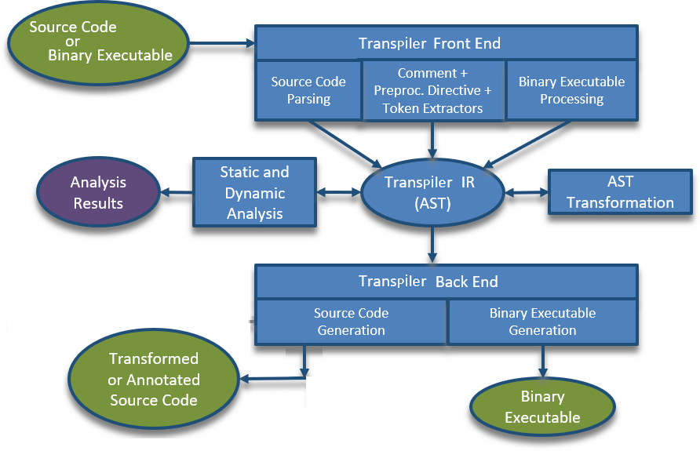

<h1> Transpiler.And.Similar.List </h1>

List Of Transpilers, TransCompilers, Decompilers, etc [source-code to source-code converter][1], &amp; similar &amp; related tools/apps.  
  
( History : I created a [question](https://stackoverflow.com/questions/64180191/) in StackOverflow(SO), where i have initially asked Which transpiler can convert `"Go"` source-code into `"C"` source-code, and then i had to change question & ask : Which transpiler (out of four specific transpiler) can convert from `Go` to `C/C++` and can still keep (almost all) high-level algorithms & structures used in source-code , fairly accurately same/intact in output source-code . And this project/data borned from that research, so later when StackOverflow's `"PRO-GOOGLE"` & `"PRO-GO"` do-evil mods ganged-up on my Quesiton+Answer & deleted it (vote to undelete [here](https://stackoverflow.com/users/recently-deleted-questions/3553808)) , i had to publish from this github project, & improve it here. )  
<br />

<a name="License"></a>
# LICENSE&#8239; &&#8239; COPYRIGHT&#8239; &&#8239; PERMISSIONS&#8239; &&#8239; RESTRICTIONS&#8239;:
<div width="100%"><b>LICENSE of this project "Transpiler.And.Similar.List":</b><br />
 "Transpiler.And.Similar.List" project pages, info, data, file, etc
 are <b>Released with following combined LICENSE(s) + 
 RESTRICTIONs + PERMISSIONs:</b><dl>
 <dd> 
  <b class="b">•</b> Do Not Use This To Violate/Break/Ignore/Deprive/Steal HUMAN-RIGHTS.<br />
  <b class="b">•</b> Do Not Use This To Kill/Harm/Violate (or Steal-from)(Any) Human/Community,Earth,etc.<br />
  <b class="b">•</b> Do Not Use Any Data/File From This Project Into Military/Offense/Attack/Killing Forces,etc.<br />
  <b class="b">•</b> Do Not Use Any Data/File From This Project To File LawSuit Against Someone Who Uses It/Derivative To Save/Protect Life,Liberty,Privacy,Correct-Information,Community,Earth,etc.<br />
  <b class="b">•</b> Do Not Use Remove Any Of These Restrictions & Permissions.<br />
  <b class="b">•</b> No-Permission Given/Granted To Anyone To Send Me/Us About "Information" Take-Down Or Removal Notice/Request , Access To "Information" Is A Fundamental Human-Right , And So Information Cannot Be Taken-Down Or Removed . People's Security Inside A Country Has More Priority Than Their Country's Corrupt-Government Officials Or Evil Businessman's Continuation Of Criminal-Acts On Human/Community, Other-Countries, Earth . People Of One Country Or Corrupt-Gov Of One Country Or "National-Security" Of One Country Or Even Multiple Of Them Combined , Are NOT Above The "Human-Rights" / "Humanity" . No One Have More Right To Kill/Deprive/Violate People Of Another/Inside Country Or Other People . Corrupt Laws Or InHumane Laws Are Never Above "Human-Rights" or "Humanity" . Security+Safety+Stablity Of All People Begins-With & Increases-With Correct Information & Awareness . Information (On An Item, Listed Here) Can Be Informative & Used For Correct/Good Purpose Or For Taking Correct/Good (Informed) Decision After Analysis With It Or Information Can Be Used For Defense Or Can Be Used To Reduce Crime Or Catch Criminal Developer Or Initiators, etc . Actual Listed Items Are Not Located Here in This List Or Research Documents.<br />
  <b class="b">•</b> Peaceful Open Source License, "<a href="License_PeaceOSL_for_TranspilerList.txt">PeaceOSL</a>", v2020-10-28<br />
  <b class="b">•</b> Copyright <b>©</b> 2020 atErik (Erik T. Ashfolk) (&lt;at&#69;rik＠Ö&#965;ťĹö&#333;ķ·ċ&#333;m;
  at&#69;rïķ＠&#65;śh&#70;ölķ·ć&#333;m&gt;<br />
  &#160;&#160;&#160;&#160;Do Not Copy Eml-Adrs, Type In 
  English/<a href="https://en.Wikipedia.org/wiki/Basic_Latin_%28Unicode_block%29" target="_blank">basic-Latin</a> 
  Char, No-Permission is Given To Solicit)&#46;<br />
  &#160;&#160;&#160;&#160;All rights reserved.<br />
  <br />
  <br />
  <code><pre>
--- BEGIN the Peaceful Open Source License ---

Transpiler.And.Similar.List : List of transpilers, transcompilers,
decompilers, etc.
Copyright (C) 2020 Erik T. Ashfolk (atErik at ashfolk dot com).

Redistribution and use of the software accompanying this license in
source and binary forms, with or without modification,
are permitted provided that the following eight conditions are met:

1. Redistributions of source code must retain the above copyright
   notice, this list of conditions and the following disclaimer.
2. Redistributions in binary form must reproduce the above copyright
   notice, this list of conditions and the following disclaimer in
   the documentation and/or other materials provided with the
   distribution.
3. Modifications to the source code must retain the above copyright
   notice, this list of conditions, and the following disclaimer,
   and may not include further conditions or licensing which go
   against the spirit of this license.
4. This software must not be used to cause deliberate harm to any
   human individual, group, community or country, either directly
   or indirectly, in any form.
5. This software must not be used to steal from any human individual,
   group, community, country or earth, either directly or indirectly,
   in any form.
6. This software must not be used to violate (any) human-rights,
   either directly or indirectly in any form, neither in any physical
   location, nor in any form of etherspace/cyberspace/Internet.
7. This software must not be used by any Military, Military branches,
   Law Enforcement, Law Enforcement branches, or by any Service/Items
   provider or supplier for Military or Law Enforcement.
8. This software must not be used by either any Corrupt or
   Human-Rights Violating (C-o-HR-V) Government(Gov), C-o-HR-V Gov
   branch offices, C-o-HR-V companies/corporations/businesses,
   C-o-HR-V organizations, groups, etc Or by any C-o-HR-V private
   offices, businesses, etc Or by any person working in any of
   mentioned entity in this section.

DISCLAIMER : THIS SOFTWARE IS PROVIDED BY THE COPYRIGHT HOLDERS
AND CONTRIBUTORS "AS IS", AND ANY EXPRESS OR IMPLIED WARRANTIES,
INCLUDING, BUT NOT LIMITED TO, THE IMPLIED WARRANTIES OF
MERCHANTABILITY AND FITNESS FOR A PARTICULAR PURPOSE ARE DISCLAIMED.
IN NO EVENT SHALL THE COPYRIGHT HOLDER, AUTHORS, OR CONTRIBUTORS BE
LIABLE FOR ANY DIRECT, INDIRECT, INCIDENTAL, SPECIAL, EXEMPLARY, OR
CONSEQUENTIAL DAMAGES (INCLUDING, BUT NOT LIMITED TO, PROCUREMENT OF
SUBSTITUTE GOODS OR SERVICES; LOSS OF USE, DATA, MONEY, POSSESSIONS,
OR LIFE; OR BUSINESS INTERRUPTION) HOWEVER CAUSED AND ON ANY THEORY
OF LIABILITY, WHETHER IN CONTRACT, STRICT LIABILITY, OR TORT
(INCLUDING NEGLIGENCE OR OTHERWISE) ARISING IN ANY WAY OUT OF
THE USE OF THIS SOFTWARE, EVEN IF ADVISED OF THE POSSIBILITY OF
SUCH DAMAGE.

--- END of the Peaceful Open Source License ---
  </pre></code>
  Get copy of PeaceOSL license from <a href="License_PeaceOSL_for_TranspilerList.txt">here</a>.<br />
  <br />
  <br />
  <br />
  <b class="b">•</b> (All other trademarks, etc cited here are the property 
  of their respective owners&#46;)<br />
  <b class="b">•</b> (All other copyright items cited here are the copyright 
  of their respective author/creator&#46;)<br />
  <br />
  <br />
  <br />
  <h3>IF&#8239; YOU&#160; DO&#8239; NOT&#8239; AGREE&#160; WITH&#8239; ABOVE&#160; LICENSE&#8239; RESTRICTIONS&#8239; &&#8239; PERMISSIONS&#8239;,&#160; THEN&#160; YOU&#160; CANNOT&#160; USE&#160; ANY&#160; DATA/SERVICE&#160; FROM&#160; THIS&#160; PROJECT&#8239; OR&#8239; WEB-PAGES&#8239;, PRESS&#160; BACK&#8239; BUTTON&#160; IN&#8239; YOUR&#8239; WEB-BROWSER&#8239;,&#160; AND&#160; COMPLETELY&#160; STOP&#160; USING/VIEWING&#8239; THIS&#8239; WEBPAGE/DATA ( AND&#8239; ANY&#8239; OTHER&#8239; WEBPAGES/DATA&#8239; UNDER&#8239; IT ).</h3>
  <h3>IF&#160; YOU&#160; AGREE&#160; WITH&#160; ABOVE&#160; LICENSE&#160; RESTRICTIONS&#160; &&#160; PERMISSIONS&#160;,&#160; ONLY&#160; THEN&#160; SCROLL&#160; DOWN&#160; &&#160; VIEW&#160; DATA.</h3>
  </dd>
 </dl>
</div>
<br />
<br />
<br />
<br />
<br />
<br />
<br />
<br />
<br />
<br />
<br />
<br />

# TRANSPILE&#8239;:
&#160;&#160;&#160;&#160;<b>CPL</b>&#160;=&#160;Computer&#160;Programming&#160;Language &#124; <b>f.e.</b> = for-example &#124; <b>i.e.</b> = in-example &#124; <b>e.g.</b> = example-goes-to.  

Which TRANSPILER Can Convert/**[Transpile][1]**/Transcompile/Transform Input Source-Code (for-example: `"Go"` or Any/✱ other CPL) Into (A Different Language) Output Source-Code (for-example: `"C"` or Any/✱ other CPL) <b>?</b>  

Which TRANSPILER Can Keep High-Level Algorithms / Structures Used In Input Source-Code (f.e: `"Go"` or Any/✱ other CPL) Fairly Accurately Intact/Same After Conversion Into A Different Language Based Generated / Output / Destination / Target Source-Code (f.e: `"C"` or Any/✱ other CPL), As Much As Possible <b>?</b>  
<br />

( abbreviations : `lang` = language &#124; `C++` = `Cpp` = `C-plus-plus` &#124; `Go` = `Golang` )  

TRANSPILE : source-code to source-code conversion , where high-level structures, algorithms, etc (of input code) are usually kept same or accurate during conversion process (in output code) . Sometime extra codes are needed in output code, to function same as input code.  
<br />
<br />

<h4>( YOU MAY GOTO <a href="List/">LIST OF ALL TRANSPILERS</a> DIRECTLY FROM <a href="List/">HERE</a> )</h4>
<br />
<br />

# SOURCE-CODE&#8239; EXAMPLES&#8239;:
For example, when input code (`"Go"` language code) contains:
```Go
// "Go" based source-code:
var n int
type Node struct {
    left, right *Node
    data    interface{}
}

func twice(f func(int) int, v int) int {
    return f(f(v))
}

func main() {
    f := func(v int) int {
        return v + 3
    }
    twice(f, 7) // returns 13
}
```

Then, this `"Go"`-to-`"C"` conversion/transpilation<sup>[1][2]</sup> process need to convert & generate/output below `"C"` language code:
```C
// Converted "C"-lang based source-code
#include <stdio.h>

typedef int (*int_func_int) (int);

int n;
struct Node {
    struct Node *left, *right;
    void    *data;
};

int add3(int x) {
    return x + 3;
}

int twice(int_func_int f, int v) {
    return f(f(v));
}

int main() {
    printf("%d\n", twice(add3, 7));
    return 0;
}
```

When `"Go"`-to-`"C++"` (`C++14`) transpilation is done, then output should be:
```C++
// Converted "C++"(C++14)-lang based source-code
#include <iostream>

int n;
struct Node {
    struct Node *left, *right;
    void    *data;
};  

auto twice = [](auto f, int v)
{
    return f(f(v));
};

auto f = [](int i)
{
    return i + 3;
};

int main()
{
    std::cout << twice(f, 7) << std::endl;
}
```

When `"Go"`-to-`"C++"` (`C++11`) transpilation is done, then output should be:
```C++
// Converted "C++"(C++11)-lang based source-code
#include <iostream>
#include <functional>

int n;
struct Node {
    struct Node *left, *right;
    void    *data;
};  

auto twice = [](const std::function<int(int)>& f, int v)
{
    return f(f(v));
};

auto f = [](int i)
{
    return i + 3;
};

int main()
{
    std::cout << twice(f, 7) << std::endl;
}
```
An actual EXAMPLE of "C"-to-"Go" CODE is shown [here][3] <sup>[2][4], [3][5]</sup>, but we want opposite of "C"-to-"Go" : so we want "Go"-to-"C" (go-to-c / go2c).  
<br />
<br />

# FEW&#160; POINTS&#8239;:
`•` Let us assume, you're more familiar with `"C"` & `"C++"` more, than `"Go"`.  
`•` In computer programming language, let us assume, `C`/`C++`/`Assembly` are your native computer language (these you have learned in School/University, & then practiced).  
`•` So it should be okay to convert `non-C` & `non-C++` language `"Go"` aka: `"Golang"` , into `"C"` or `"C++"`, to understand better.  
`•` Learning a second computer language (for example: `"Go"`) (or lets say: French) & hoping to become expert within 7-days or so like your native computer language (`"C"` or `"C++"`) (or lets say: English) , is not only a plain wrong expectation , if any fool suggested such then that i consider a wrong advice , because this will NOT take you to a LEVEL where you can begin to contribute in real open-source projects . But one of the right advice can be this : Start to learn+practice the second computer language in parallel (in a different, easy & forked project), as it will take long time & effort to reach expert level in that second computer language.  
`•` So, we do not want to keep any input (`"Go"`) source-code remaining in output (`C/C++`) source-code . ( But some `Assembly` is fine in output if you're okay with `Assembly` language ) . And also be aware of that ['Go' Has Problems](https://github.com/ksimka/go-is-not-good) <sup>[2][6], [3][7], [4][8]</sup> , [Security Vulnerabilities of 'Golang'][9] <sup>[2][10], [3][11], [4][12], [5][13]</sup>, etc are just few reasons to move away from `"Go"`, and use other language . You have full freedom & right to choose what you want to do.  
`•` Let us assume, Necessary Features or Functionality that i or you need to add, those are developed & optimized for `C/C++`, not-available in `"Go"`.  
`•` Programs that i or you want to TRANSPILE/CONVERT from `Go-to-C` or from `Go-to-C++`, that type of programs should be developed with `C/C++`, as that type of programs work better with `C`, and even more better with `C++`.  
`•` Recreating complex & large software/systems with years of development from scratch with another (second) computer language , is not-only hard , that is also not-suggested<sup>[1][14]</sup> (not-adviced) , So transcompilation steps are helpful to give a head-start by converting easier source-code . Transcompilation process always requires human developer based manual code conversion, as none of the Transpilers are perfect or supports ALL aspects of source/input language or different programming styles, codes, libraries, etc that are used in real practical projects/languages . Small project(s) or new project can be built from scratch, and even by using a second computer language.  
`•` If source code is from open-source project , then Human/manual and/or automated transpilation of output source-code should also be released as open-source , same as input source-code . In that way, another group of developers skilled at output language (`C/C++`) can also participate in open-source development, to help all users & people.  
<br />  
<br />

<h4>( YOU MAY GOTO <a href="List/">LIST OF ALL TRANSPILERS</a> DIRECTLY FROM <a href="List/">HERE</a> )</h4>
<br />
<br />

# SOLUTIONS&#160; FOR&#160; 'Go'-TO-'C'&#8239;:
Currently, i SPECIFICALLY have these solutions/choices to use:  
`•` Solution A or #1 : "[go2cs][15]", "[CSharp.lua][16]", "[lua2c][17]".  
`•` Solution B or #2 : "[go2cs][15]", "[Blazor][18]", "[wasm2c][19]".  
`•` Solution C or #3 : "[gomoku][20]", "[Cfront][21]" or "[Comeau C&#47;C&#43;&#43;][22]".  
`•` Solution D or #4 : "[go2c][23]".  
`•` ...  
<br />
<br />
WHICH&#160; `Go`-To-`C` SOLUTION&#160; (out of above solutions) IS BETTER <b>?</b>  
( better at keeping high-level algorithms/structures,etc fairly or accurately same in output source-code )  
is there (similar) better transpiler solution, among the links that i have shown ?  
Above (transpiler-set) solutions have what Pros/Cons ?  
<br />
<br />

<h3>SOLUTION&#160; ANALYSIS&#160; &amp;&#160; PROs/CONs&#160; &amp;&#160; PROBLEM(s):</h3>

<h4>SOLUTION A or &#35;1&#8239;:</h4>
Solution-Set A or &#35;1&#8239;:
<ul><li> steps: we are attempting to do these:<br />
<code>"Go"</code>--&gt;<code>"C#"</code>--&gt;<code>"Lua"</code>--&gt;<code>"C"</code>
  <ul><li> (<b>A</b>-1) use this 
  "<a href="https://github.com/GridProtectionAlliance/go2cs">go2cs</a>" 
  transpiler to convert <code>"Go"</code>/<code>"Golang"</code> source-code 
  into <code>"C#"</code> (C-sharp) based code.
    <ul><li> (place your GoProject here: <code>D:\Dev\GoProject\</code>)<br />
    (create & go inside this folder: <code>D:\Dev\Go-to-CS-GoProject\</code>)<br />
    Convert a single <code>Go</code> file: <code>go2cs -l D:\\Dev\\GoProject\\src\\Main.go</code><br />
    Convert entire <code>Go</code> project: <code>go2cs D:\\Dev\\GoProject</code><br />
    Convert <code>Go</code> Standard Library: <code>go2cs -s -r D:\\Dev\\GoProject\\src\\</code>
    </li>
    </ul>
  </li>
  <li> (<b>A</b>-2) convert that <code>"C#"</code> source-code into 
  <code>"Lua"</code> code with this 
  "<a href="https://github.com/yanghuan/CSharp.lua">CSharp.lua</a>" transpiler.
    <ul><li> <tt>D:&#92;&gt; dotnet CSharp.Lua.Launcher.dll -h </tt><br />
<pre><code>Usage: CSharp.lua [-s srcfolder] [-d dstfolder]
Arguments
-s : can be a directory where all cs files will be compiled, or a list of files, using ';' or ',' to separate
-d : destination directory, will put the out lua files
Options
-h : show the help message and exit
...</code></pre>(source 
    folder should be: <code>D:\Dev\Go-to-CS-GoProject\</code>)<br />
    (create & specify destination folder: <code>D:\Dev\CS-to-Lua-GoProject\</code>)
    </li>
    </ul>
  </li>
  <li> (<b>A</b>-3) convert that <code>"Lua"</code> source-code into 
  <code>"C"</code> code with this "<a href="https://github.com/davidm/lua2c">lua2c</a>" 
  transpiler.
    <ul><li> (create & go into a folder 1st like this: <code>D:\Dev\Lua-to-C-GoProject\</code> 
    or specify previous as destination folder in next command)<br />
    <code>lua</code> to <code>C</code> cmd: <code>lua lua2c.lua D:\Dev\CS-to-Lua-GoProject\Main.lua</code>
    </li>
    </ul>
  </li>
  </ul>
</li>
<li> in this solution-"A", a developer have to be familiar with <code>"C#"</code> & 
<code>"Lua"</code>, and you can also clearly see that transpile/conversion occurred 3-TIMES : 
<code>"Go"</code>--&gt;<code>"C#"</code>--&gt;<code>"Lua"</code>--&gt;<code>"C"</code>, 
which is not-very-good . Conversion done by <code>go2cs</code> is high-quality(<b>HQ</b>), 
but other tools in chain are not that much HQ, so overall conversion quality is not good.<br />
As dev/user also need to know middle language(s), ( and i'm not very familiar with 
<code>C#</code> or <code>Lua</code> ).<br />
In solution-"A", atleast final destination <code>"C"</code> code will still 
have high-level structures fairly intact that were used in initial 
<code>"Go"</code> source-code.
</li>
</ul>
<br />

<h4>SOLUTION B or &#35;2&#8239;:</h4>
Solution-Set B or &#35;2&#8239;:
<ul><li> steps: in this solution we attempt to do these:<br />
<code>"Go"</code>--&gt;<code>"C#"</code>--&gt;<code>"WebAssembly"</code>--&gt;<code>"C"</code>. 
(also see alternative Solution-E)
  <ul><li> (<b>B</b>-1) use this "<a href="https://github.com/GridProtectionAlliance/go2cs">go2cs</a>" 
  transpiler to convert <code>"Go"</code>/<code>"Golang"</code> source-code 
  into <code>"C#"</code> (C-sharp) based code.
    <ul><li> see sub-section inside above Solution-A-1.
    </li></ul>
  </li>
  <li> (<b>B</b>-2) convert that <code>"C#"</code> source-code into 
  <code>"WebAssembly"</code> code with this 
  "<a href="https://github.com/aspnet/AspNetCore/tree/master/src/Components">Blazor</a>" 
  transpiler.</li>
  <li> (<b>B</b>-3) convert that <code>"WebAssembly"</code> source-code into 
  <code>"C"</code> code with this 
  "<a href="https://github.com/WebAssembly/wabt/tree/master/wasm2c">wasm2c</a>" 
  transpiler.</li>
  </ul>
</li>
<li> in this solution-"B" also doing conversion 3-TIMES : 
<code>"Go"</code>--&gt;<code>"C#"</code>--&gt;<code>"WebAssembly"</code>--&gt;<code>"C"</code>, 
but these steps will completely breakdown all high-level structures & meaningful 
programming codes into large amount of micro (machine level) elements, etc,<br />
Thus its depriving me or developer from chance to improve 
source-code further or improve quickly.<br />
( btw, in my case, i'm familiar with <code>"Assembly"</code> & <code>"C"</code> & 
also <code>"C++"</code> ).
</li>
</ul>
<br />

<h4>SOLUTION C or &#35;3&#8239;:</h4>
Solution-Set C or &#35;3&#8239;:
<ul><li> (<b>C</b>-1) use this "<a href="https://github.com/lpereira/gomoku">gomoku</a>" 
transpiler to convert <code>"Go"</code>/<code>"Golang"</code> source-code into 
<code>"C++"</code> based code.
  <ul><li>(<b>C</b>-2) convert that <code>"C++"</code> source-code into <code>"C"</code> 
  code with (any one of these) transpilers like these: 
  <a href="http://www.softwarepreservation.org/projects/c_plus_plus">Cfront</a>, 
  <a href="http://www.comeaucomputing.com/">Comeau C&#47;C&#43;&#43;</a>, 
  also see these SO(StackOverflow) pages for more info: 
  <a href="https://stackoverflow.com/questions/737257/">1</a>, 
  <a href="https://stackoverflow.com/questions/15970804/">2</a>, 
  <a href="https://stackoverflow.com/questions/1833484/">3</a>, 
  <a href="https://stackoverflow.com/questions/5050349/">4</a>.<br />
  Compiler tools can also convert <code>C++</code>-to-<code>C</code><sup><a href="https://github.com/JuliaComputing/llvm-cbe">1</a></sup>:<br />
  &#160;&#160;<code>clang -c CPPtoC.cpp -o CPPtoC.bc -emit-llvm</code><br />
  &#160;&#160;<code>clang -march=c CPPtoC.bc -o CPPtoC.c</code><br />
  &#160;&#160;&#160;or<br />
  &#160;&#160;<code>llvm-g++ -c CPPtoC.cpp -o CPPtoC.bc -emit-llvm</code><br />
  &#160;&#160;<code>llc -march=c -enable-correct-eh-support CPPtoC.bc -o CPPtoC.c</code>
  </li>
  </ul>
</li>
<li> in this solution-"C" steps , transpile/conversion occurred 2-TIMES : 
<code>"Go"</code>--&gt;<code>"C++"</code>--&gt;<code>"C"</code> . In "Go"-to-"C++" conversion by "gomoku", only subset (smaller portion) of "Go" is supported, but it can keep high-level structures/algorithms, etc intact . Then, in "C++"-to-"C" conversion stage, output quality varies . When LLVM/llc, etc are used, then output "C" does not have input's high-level structures intact anymore . Comeau C&#47;C&#43;&#43; appears able to keep high-level structures intact during "C++"-to-"C" conversion, but it is a proprietary (aka: not-openSource) & older tool.
</li>
</ul>
<br />

<h4>SOLUTION D or &#35;4&#8239;:</h4>
<ul><li> (<b>D</b>-1) use this "<a href="https://github.com/mukadr/go2c">go2c</a>"(mukadr) 
transpiler to convert <code>"Go"</code> source-code into <code>"C"</code> 
based code, though it can transpile <code>"Go"</code>-to-<code>"C"</code> 
by itself, but at this moment (when this was posted here), 
sadly this supports only a subset components of Go.  
These transpilers can also be used for <code>Go-to-C</code> conversion : 
<a href="https://github.com/gopherc/goc">goc</a>, 
<a href="https://github.com/mewbak/go-transpiler">go-transpiler</a>(mewbak), 
etc, but these also only supports subset of <code>"Go"</code> language, 
at this moment (when this was posted here).
</li>
<li> in this solution-"D", transpiler can convert 'Go' into 'C' directly 
in one-time w/o using any other intermediate transpilers : 
<code>Go</code>--&gt;<code>"C"</code> , but does not support conversion 
of all components of <code>Go</code>-language.
</li>
</ul>
<br />

<h3>EXTRA - SOLUTIONS&#8239;:</h3>

<h4>SOLUTION E or &#35;5&#8239;:</h4>
Solution-Set E or &#35;5&#8239;:
<ul><li> steps: this Solution-E is alternative of above Solution-B.
  <ul><li> (<b>E</b>-1) use these commands to convert <code>"Go"</code> into 
  <code>"Go"-"Assembly"</code>, <code>"go2goasm"</code>, output of 
  <code>"Go"</code>-tool is a Google/Golang flavored <code>"Assembly"</code>, 
  its not completely Standard/regular <code>Assembly</code>, but close to it . 
  Commands:<br />
  <code>go tool compile -S Main.go</code><br />
  &#160;or<br />
  <code>go build -gcflags -S Main.go</code>
  </li>
  <li> (<b>E</b>-2) use <a href="https://sourceforge.net/projects/boomerang/">Boomerang</a> 
  decompiler<sup><a href="https://github.com/radareorg/radare2">2</a>, 
  <a href="https://github.com/radareorg/r2dec-js">3</a></sup> on <code>Go-"Assembly"</code> 
  source-code file, and manually change/convert incompatible portions into general 
  <code>Assembly</code> until Boomerang can do Asm-to-C conversion . Or use 
  <a href="https://github.com/frranck/asm2c">asm2c</a>, etc transpiler, that can convert 
  <code>Assembly</code>(<code>Asm</code>) into <code>C</code> 
  (<code>Asm</code>-to-<code>C</code>) . Other solutions are mentioned 
  <a href="https://reverseengineering.stackexchange.com/questions/3748/">here</a>, 
  <a href="https://stackoverflow.com/questions/1376856/">2</a>, 
  <a href="https://reverseengineering.stackexchange.com/questions/2096/">3</a>.
  </li>
  </ul>
</li>
<li> Conversion happens 2-TIMES : 
<code>"Go"</code>-&gt;<code>"Assembly"</code>-&gt;<code>"C"</code> . Because of 
"go2asm" conversion, allmost all higher-level structures in <code>"Go"</code> 
will go away from <code>"Assembly"</code> (low-level language) . So, after 
<code>Assembly</code> to <code>C</code> conversion , <code>C</code> source-code 
will not-include any high-level structures of "Go" source, new high-level 
<code>C</code> will be something different, though functioning same way.<br />
Usually this solution is faster.
</li>
</ul>
<br />

<h4>SOLUTION F or &#35;6&#8239;:</h4>
<ul><li> steps:
  <ul><li> (<b>F</b>-1) use 
  "<a href="https://github.com/GridProtectionAlliance/go2cs">go2cs</a>" 
  to convert <code>"Go"</code> into 
  <code>"C#"</code>(<code>CSharp</code>).<br />
  see sub-section under Solution-A-1, for usage.
  </li>
  <li> (<b>F</b>-2) use 
  "<a href="https://sourceforge.net/projects/hurley/">hurley]</a>" 
  to convert <code>C#</code> into <code>C</code>.
  </li>
  </ul>
</li>
<li> Conversion happens 2-TIMES : 
<code>"Go"</code>-&gt;<code>"C#"</code>-&gt;<code>"C"</code> . 
Many higher-level structures in <code>"Go"</code> will remain in final output . 
The "go2cs" does HQ conversion, but next step not that much, need more improvements.
</li>
</ul>
<br />

<h4><s>&#160;SOLUTION G or &#35;7:&#160;</s></h4>
<ul><li> <s>&#160;(<b>G</b>-1) "<a href="https://github.com/supercoww/go-transpiler">go-transpiler</a>"(supercoww) . According to it's dev, though original goal was to make a transpiler but now its a parser that checks if code is valid as per Golang grammar.&#160;</s>
</li>
</ul>
<br />

<h4>OTHER&#8239;:</h4>
This "<a href="https://github.com/andygeiss/esp32-transpiler">esp32-transpiler</a>" can convert 'Go' into 'C' for Arduino (an embedded system), but only small subset of 'Go' lang spec is supported.  
<br />

<h3>CONCLUSION OF "Go"-To-"C" SOLUTIONS&#8239;:</h3>
<ul><li> at this point:<br />
  So, solution-"A" (go2cs-&gt;CSharp.lua-&gt;lu2c) is better than solution-"B" (go2cs-&gt;Blazor-&gt;wasm2c).<br />
  solution-"E" (go2asm-&gt;asm2c) is obviously better than solution-"B" (go2cs-&gt;Blazor-&gt;wasm2c).<br />
  solution-"F" (go2cs-&gt;hurley) is better than solution-"A" (go2cs-&gt;CSharp.lua-&gt;lu2c).<br />
  solution-"C" (gomoku-&gt;cfront) is better than solution-"A" (go2cs-&gt;CSharp.lua-&gt;lu2c).<br />
  solution-"F" (go2cs-&gt;hurley) is better than solution-"C" (gomoku-&gtcfront;).<br />
  solution-"C" (gomoku-&gt;cfront) is better than solution-"D" (go2c/goc/go-transpiler).<br />
  So, solution-"F" (go2cs-&gt;hurley) is best <code>"Go"</code>-to-<code>"C"</code> transpiler-set,<br />
  at this point, among previous choices (when this message was posted here 2020-Oct-22).<br />
  <i>Note: none of these transpilers support all components of "input" language, but their developers are improving them , So, often check out supported component list & which is shown in their website, and compare.</i>
</li>
</ul>
<br />
<br />

<h4>( YOU MAY GOTO <a href="List/">LIST OF ALL TRANSPILERS</a> DIRECTLY FROM <a href="List/">HERE</a> )</h4>
<br />
<br />
<br />

# SOLUTIONS&#160; FOR&#160; 'Go'-TO-'C++'&#8239;:
Many developers have pointed out, in some cases `C++` (based compiled program) can often be much better & faster than `C` ones, so i'm also displaying these few options in below to convert/transpile `Go` source-code directly (or via multiple stages) into `C++` source-code while keeping higher-level algorithms & structures fairly intact/accurate as much as possible , in this way output `C++` source-code is also easier to improve as/when necessary:
* SOLUTION CHOICES&#8239;:
  * ALT-SOLUTION A or &#35;1<b>:</b> use [gomoku][20] for `Go` to `C++`.
  * ALT-SOLUTION B or &#35;2<b>:</b> use [go2cpp][24] for `Go` to `C++20`/`C++17`.
  * ALT-SOLUTION C or &#35;3<b>:</b> use [GoLite Transpiler][25] for `GoLite` (subset of `Go`) to `C++` . GoLite Transp supports only subset of `Go`.
  * ALT-SOLUTION D or &#35;4<b>:</b> use [go2cs][15] for `Go` to `C#`(C-Sharp), then use any of these: [cs2cpp][26], [Alter-Native][27], [CoreRT][28], [OneLang][29], [Ranger][30], etc to convert `C#` into `C++`.
  * ALT-SOLUTION E or &#35;5<b>:</b> use [go-transpiler][31](Theodus) for `Go` to `C++`.
* WHICH&#160; `Go`-To-`C++` SOLUTION&#160; (out of above solutions) IS BETTER <b>?</b>  
  ( better at keeping high-level algorithms/structures,etc fairly or accurately same in output source-code )
* CONCLUSION ON `"Go"`-TO-`"C++"`<b>:</b>  
  Alt-Solution-A (gomoku) is obviously slightly better than Alt-Solution-B (go2cpp),  
  and Alt-Solution-B (go2cpp) is much better than Alt-Solution-C (GoLite Transp),  
  and Alt-Solution-D (go2cs+cs2cpp) is also much better than Alt-Solution-C (GoLite Transp).  
  In Alt-Soln-D, though `go2cs` conversion quality is higher, but next stage `cs2cpp` tools are not.  
  and Alt-Solution-D (go2cs+cs2cpp) is better than Alt-Solution-B (go2cpp).  
  So Alt-Solution-A (gomoku) is best at this point, among these available transpiler choices, (when this message was posted here).  
<br />
<br />
<br />

&#160;&#160;&#160;&#160;abbreviations&#160;:&#160;`aka` = also known as  

# TRANSPILER&#160; INTERNALS&#8239;:
  
Transpiler/Transcompiler<sup>[1][1]</sup> internally contains primarily three major components<b>:</b>
* 1of3: Parser : it is used to create Abstract Syntax Tree(AST)<sup>[1][32]</sup> from input/source code, by using Lexical<sup>[1][33]</sup> analysis and Syntax<sup>[1][34]</sup> analysis.  
  • [Comparison of Parser-Generators and Lexer-Generators][35].
* 2of3: Transformation : with one or more steps, input code's AST will be converted into output/target code's AST . Uses semantic<sup>[1][36]</sup> analysis, Intermediate Representation (<b>IR</b>)<sup>[1][37]</sup> generation . IR is aka: Intermediate Language (<b>IL</b>)<sup>[1][38]</sup>.
* 3of3: Generator : output AST is used to generate output/target language code.
* Transpiler can/may use MetaProgramming<sup>[1][39]</sup>, NLP(Natural Language Processing)<sup>[1][40]</sup>, Finite-state Automata<sup>[1][41], [2][42]</sup>, Lexical Analysis<sup>[1][33]</sup>, Syntax/AST Analysis<sup>[1][32]</sup>, Parser<sup>[1][43], [2][44]</sup>, etc<sup>[1][35]</sup>, etc, to convert source-code of one CLP(computer programming language) into source-code of another CLP.
* Notes/References:  
 `•` [Transpiler][45].  
 `•` [How to write a transpiler][14], [2][46].  
 `•` [Transpiling between any languages][47].  
 `•` Shown "Transpiler Diagram Image" in above, is a modified image of original image, which was obtained from <a href="http://RoseCompiler.org/">RoseCompiler</a> website . Rose compiler is released with BSD modified license, and it was developed at <a href="https://computing.llnl.gov/projects/rose-compiler">Lawrence Livermore National Laboratory</a>(LLNL), Livermore, California, United States.  
<br />
<br />
<br />

# OTHER&#160; INFORMATION&#160; &&#160; REFERENCES&#8239;:
I have added reference-links immediately after each sentence or section bu using superscript numbers.  

**Go2C** Conversion : My objective is here is to share simple steps/directions on converting / TRANSPILING `Go`-language source-code into `C` (or `C++`) lnaguage source-code , with one of the mentioned (in above) possible set of TRANSPILER-set solutions , that can still keep high-level algorithms / structures, etc used in initial/input `Go` source-code , fairly or accurately same/intact in final destination / output `C` (or `C++`) source-code.  

Then we can compile such transpiled/transcompiled `C/C++` source-code (into binary machine code) when necessary, to run it faster.  

So after `Go-to-C` or `Go-to-C++` source-code conversion , it will be possible to change source-code , to add required necessary feature or functionality , and improve `C` (or `C++`) source-code.  

Some users have mis-conception (aka: brainwashed) about `"Go"` computer programming language , and some users intentionally lies purposefully as they work under some projects from "Google" or projects supported by "Google", or working under a project that uses Google products, for-example : Google's "Go" language, Google Advertisements, Violating Privacy-Rights (aka Spying on People,Citizens,Users,Persons), etc, etc , these are hard-core Google-PUSHERS/supporters , some of these criminal/"evil" acts are very dangerous Anti-Humanity (Anti-Human-Rights) activities.  

We need to push Google (and it's parent company: Alphabet) and it's corporate-controllers by exposing their criminal & "evil" activities , so that their harmful & "evil" acts are Questioned & punished , so that in end Google (and Alphabet) & it's corp-controllers chooses real good & correct & non-"evil" ways to do good & correct & non-"evil" things for People, Citizens, Users , not-only inside USA but for entire World.  
In entire world, country after country are now filing Lawsuit against years of Google's "evil"/hamrful practices . So if Google/Alphabet wants to do business with/for people/companies, they need to cultivate good & non-"evil" practices.<sup>[1](https://en.wikipedia.org/wiki/Criticism_of_Google), [2](https://en.wikipedia.org/wiki/Google_litigation), [3](https://www.bbc.com/news/business-52887340), [4](https://www.reuters.com/article/us-alphabet-google-privacy-lawsuit-idUSKBN23933H), [5](https://www.nytimes.com/2020/09/21/technology/google-antitrust-justice-department.html), [6](https://www.nationalreview.com/news/department-of-justice-state-attorneys-general-to-sue-google-for-antitrust-violations-report/)</sup>

So, I have added data/info from accredited computer COMPETITION , BENCHMARKS , etc to prove which computer programming language is better & which is not.  

And remember, ANYONE/USER/people have full Freedom+Right to informaton what he/she wants, and also have full Freedom+Right to convert one language into another.<sup>[1][48], [2][49], [3][50], [4][51], [5][52]</sup>  

Do not ever forget, there are people & groups who are pushing more & more for violation of human-rights , and also there are people who are pushing for establishing more human-rights.  

Some Common-Sense & Human-Rights:
* ( water is needed by human body to survive . human has right of access to water & sanitation <sup><a href="https://www.unwater.org/water-facts/human-rights/">1</a>, <a href="https://www.un.org/es/comun/docs/?symbol=A/RES/64/292&lang=E">2</a></sup> . <i>California, USA has California Water Code : “every human being has the right to safe, clean, affordable, and accessible water.”<sup><a href="https://leginfo.legislature.ca.gov/faces/codes_displaySection.xhtml?lawCode=WAT&sectionNum=106.3">1</a></sup></i> . Other USA states have no such specific right. )
* ( information is needed inside the human brain for taking correct & good decision , to survive & to survive better . human has right to information <sup>[1][53], [2][54], [3][55], <a href="http://www.unesco.org/new/en/unesco/events/prizes-and-celebrations/celebrations/international-days/world-press-freedom-day/previous-celebrations/2010/brisbane-declaration/">4</a>, <a href="http://www.unesco.org/new/en/unesco/events/prizes-and-celebrations/celebrations/international-days/world-press-freedom-day/previous-celebrations/worldpressfreedomday2009001/maputo-declaration/">5</a></sup>.<br />
UNESCO (United Nations Educational, Scientific and Cultural Organization)'s 1945 Constitution mandates “promote the free flow of ideas by word and image”<a href="http://unesdoc.unesco.org/images/0018/001841/184171e.pdf">PDF</a>.<br />
1946 UNGA Resolution 59, and 1948 Article-19 of UDHR (Universal Declaration of Human Rights) : <i>“Everyone has the right to freedom of opinion and expression; this right includes freedom to hold opinions without interference and to seek, receive and impart information and ideas through any media and regardless of frontiers.”</i> <sup>[1][56]</sup> . USA signed+Agreed to it.<br />
In "American Convention On Human Rights" (A.K.A.: Pact Of San Jose, Costa Rica) (B-32)<sup>[1][55]</sup> : <i>“Article 13. Freedom of Thought and Expression: 1. Everyone has the right to freedom of thought and expression. This right includes freedom to seek, receive, and impart information and ideas of all kinds, regardless of frontiers, either orally, in writing, in print, in the form of art, or through any other medium of one's choice. 2. ... 3. The right of expression may not be restricted by indirect methods or means, such as the abuse of government or private controls over newsprint, radio broadcasting frequencies, or equipment used in the dissemination of information, or by any other means tending to impede the communication and circulation of ideas and opinions. ... Article 14. Right of Reply: 1. Anyone injured by inaccurate or offensive statements or ideas disseminated to the public in general by a legally regulated medium of communication has the right to reply or to make a correction using the same communications outlet, under such conditions as the law may establish. ...”</i><br />
Gov = Government . Multi = Multiple.<br />
By Deceptively Using "National-Security" Excuse , A Corrupt-Gov Cannot Kill People Or Deprive People Or Violate Human-Rights Of Other People Or People Who Are Inside Their Own Country . When A Corrupt-Gov Or A Gov-Run-By-People-From-Business-Corporations Or A Gov-Run-By-Bribery-From-Business-Corporation(s) Can Deceptively Use "National-Security" Excuse To Commit More "Human-Rights" Violation, Then There Is No "Human-Rights" Left, & Nor Will "Human-Rights" Exist Anywhere . No One Human/Person, And No Group Of Multi Humans/Persons, And No One Gov Is Or No Groups Of Multi-Govs Are Above The "Human-Rights" / "Humanity"<b>.</b><br />
And By The Way, Exposing The Crime(s)+Violation(s) Of Corrupt-Gov(s) & Corrupt Corporations Is The Real "National-Security" Act , And This Must Be Done With “Freedom Of Press” , Which Is Another Part Of Human-Right : Access To Information . It Exists/Written In USA's First Ammendment Of "Bill Of Rights"(BoR) . It Is Put Into BoR In Around ~ 1791, Because Entities Similar To Colonial-British Once Violated "Human-Rights" Massively Around The World And Inside America , And It Is In "Bill Of Rights" There To Protect Humans Again From Similar Future Entities, For-Example: Evil-Zionism Evil-Corporatism, etc, Who Are Again Destroying+Violating "Human-Rights" Around The World And Inside America . Recent/Lately Many Grave+Mass Violations Are Done With Excuse Of "National-Security" , Be-Aware.<br />
When A Group Of Humans/People Vote To Kill Other Humans/People And Deceptively Calls That "Humanty" Or Upholding-"Human-Rights" , Then Such/Those Acts Are Still MASS-SCALE Violation Of "Human-Rights" And "Humanity". )
* ( Freedom of Expression on the Internet <sup>[1][57]</sup> )
* ( Press Freedom <sup>[1][58]</sup> )
<br />
<br />
<br />

&#160;&#160;&#160;abbreviations&#160;:&#160;`CPL` = Computer Programming Language &#124; `lang` = language.  

<h4>COMPETITION&#8239; ON&#8239; CAPABILITIES&#8239;:</h4>
Here are some results of a yearly COMPETITION on CPL, based on CAPABILITIES of CPL and tools<b>:</b>
<ul><li> <a href="https://en.wikipedia.org/wiki/ICFP_Programming_Contest">https://en.wikipedia.org/wiki/ICFP_Programming_Contest</a> <br />
  In this competition, 1st prize means: "it is the programming tool of choice for discriminating hackers" . 2nd prize means: "it is a fine programming tool for many applications" . 3rd prize means: "it is also not too shabby" . And "Lightning" prize means: "it is very suitable for rapid prototyping".<br />
  In 2019:&#160;&#160; 1st: <code>Rust</code> &#124; 2nd: <code>C++</code> &#124; 3rd: - &#124; Lightning: <code>C++</code> & <code>Haskell</code>.<br />
  In 2018:&#160;&#160; 1st: <code>Rust</code> &#124; 2nd: <code>C++</code>, <code>Python</code>, <code>Ruby</code>, <code>JavaScript</code>, <code>bash</code>, <code>SQL</code> &#124; 3rd: - &#124; Lightning: <code>OCaml</code>.
</li>
<li> RESULT <b>:</b> So from above section you can see, As of 2018 <code>Go</code>(Golang) HAS NOT ACHIEVED ANY PRIZE in any category . In 2002 <code>C</code> achieved 2nd prize . And in 2018 <code>C++</code> achieved 2nd prize again.
</li>
</ul>
<br />
<br />

&#160;&#160;&#160;abbreviations&#160;:&#160;`CPL` = Computer Programming Language &#124; `lang` = language.  

<h4>FAST or SLOW&#160; (COMPARISON&#8239; OF&#8239; LANGAUGE&#8239; PERFORMANCE)&#8239;:</h4>
See various benchmarks: 
<a href="https://benchmarksgame-team.pages.debian.net/benchmarksgame/">1</a>, 
<a href="https://julialang.org/benchmarks/">2</a>, 
<a href="https://attractivechaos.github.io/plb/">3</a>, 
<a href="https://github.com/drujensen/fib">4</a>, 
<a href="http://www.hildstrom.com/projects/langcomp/index.html">5</a>, 
<a href="https://github.com/kostya/benchmarks">6</a>, 
<a href="https://modelingguru.nasa.gov/docs/DOC-2783">7</a>.
<ul><li> Please also see these Q+A on CS.StackExchange site<b>:</b><br />
<a href="https://cs.stackexchange.com/questions/40400/">What Determines the Speed of a Programming-language?</a><br />
<a href="https://cs.stackexchange.com/questions/71979/">Why are some programming languages “faster” or “slower” than others?</a><br />
`CS` = Computer-Science.
</li>
<li> Benchmarks from 
"<a href="https://en.wikipedia.org/wiki/The_Computer_Language_Benchmarks_Game">The Computer Language Benchmarks Game</a>" 
(<b>CLBG</b>) are based on such criterias <b>:</b> Overall user runtime, Peak memory allocation, 
Gzip'ped size of the solution's source code, Sum of total CPU time over all threads, 
Individual CPU utilization.<br />
BE-AWARE <b>:</b> many notable developers pointed out results are not perfect benchmarks, 
due to: various programming techniques, configuration issues, weak programming, etc 
that exist in various software & hardware tools & human expertise, etc.<br />
In this CLBG <a href="https://benchmarksgame-team.pages.debian.net/benchmarksgame/q6600/which-programs-are-fastest.html">page</a> 
you can see performance chart on compiled program of different computer programming 
language (<b>CPL</b>) . I'm displaying names of selected few (not all) CPL in below 
from "Program Busy Time / Least Busy" category chart of July-1, 2020, in the ORDER 
of their placement shown there , So, better performing one (based on above mentioned 
criterias) is mentioned earlier in left-side , & less-better are mentioned later or 
after that <b>:</b> <code>C++</code> (<code>g++</code>), <code>C</code> (<code>gcc</code>), 
<code>Rust</code>, <code>Julia</code>, <code>Intel Fortran</code>, <code>Ada 2012</code>, 
<code>C# .NET Core</code>, <code>Free Pascal</code>, <code>F# .Net Core</code>, <code>Go</code>, 
<code>Java</code>, etc.
</li>
<li> RESULT <b>:</b> So you can see in above section, there is a huge performance 
gap between <code>Go</code> & <code>C</code>, or <code>Go</code> & <code>C++</code> . 
The <code>"Go"</code>(Golang) is ~2 to ~5.25 TIMES SLOWER THAN <code>"C"</code> . 
<code>"Go"/"Golang"</code> is ~2.25 to ~7 TIMES SLOWER THAN <code>"C++"</code>.
</li>
</ul>
<br />
<br />
<br />

&#160;&#160;&#160;abbreviations&#160;:&#160;`CPL` = Computer Programming Language &#124; `lang` = Language.  

# COMPARISONS&#8239; OF&#8239; CPL&#8239; COMPONENTS&#8239;:

Comparison of Programming Language's instructions, functions, components, etc:  
`•` [Basic instructions][59].  
`•` [Syntax][60].  
`•` [Higher-order function][61].  
`•` [Operators][62].  
`•` [Object-Oriented Programming(OOP)][63].  
`•` [OOP Constructor][64].  
`•` [Exception handling][65].  
<br />
<br />
<br />

&#160;&#160;&#160;abbreviations&#160;:&#160;`CPL` = Computer Programming Language.  

# DETERMINE&#8239; BETTER&#8239; TRANSPILER&#8239;:

How To Determine Which Transpiler/Tarnscompiler Is Better Than Another <b>?</b>

CHECK+COMPARE&#8239; SUPPORTED&#8239; COMMANDS&#8239;/&#8239;INSTRUCTIONS, FUNCTIONS, etc&#8239; <b>LIST</b>&#8239; PROVIDED&#8239; BY&#8239; TRANSPILER&#8239; DEVELOPER&#8239;/&#8239;WEBSITE&#8239;<b>:</b>  
Transpiler software's primary-dev or project's website displays LIST of supported commands/instructions, functions, etc language components . Their primary developer(s) & other developers are developing+improving those transpiler-projects when they can . Usually support for more options, instructions, etc are added into these Transpiler projects.  
So, you have to often <b>check</b> out those <b>LIST</b>s & <b>COMPARE</b>, to find out which transpiler is better.  
And also do this TEST : use same source file and convert with multiple transpilers (in sae category) , and check & compare output source-code file , to find out which transpiler able to do conversion completely or which one has skipped some portions or which one has done incorrect conversion.  
So, Which one is BEST, that will always change or most-likely be different at different time.  
(and "BEST" is connected with different "Category" , so based on different category there are different types of BEST, and at different time)
<br />
<br />
<br />

# PRE&#8239; &&#8239; POST&#8239; STEPS&#8239; OF&#8239; TRANSPILATION&#8239;:
Most of the time, certain code/strings need to be modified/changed, & prepared in each initial source-code (here `"Go"`) files (with [PreProcessor][66] type of software), before the primary transpiler can be used.  
And, often you also have to change some specific style of code/string in each output (here `"C"` or `"C++"`) file , and you also have to fix or change something that was not automatically generated by transpiler in output source-code.  
So use below code/string replacing script-codes, mentioned in below linked SO/SE pages:
* These SO(StackOverflow)/&#8239;SE(StackExchange) Q+A(s) are showing various solutions:  
 `•` [Use sed to replace a multi line string][67].  
 `•` [Do recursive find &amp; replace string with awk or sed][68].  
 `•` [Find &amp; replace string in all files recursively using grep &amp; sed][69].  
 `•` [How can I replace a newline &#40;&#92;n&#41; using sed&#63;][70].  
 `•` [Re2c][71]: fast flexible scanner for regular expression matching.  
 `•` [Recursively read folders & execute command on each][72].  
 `•` [Process all files in all directories][73].  
 `•` [Execute command on all files in a directory][74].  
 `•` [In Bash, Handle paths that have spaces and wildcards][75].  
<br />
<br />
<br />

ANY USER/PEOPLE HAVE FULL FREEDOM+RIGHT TO INFORMATION ON ANY LANGUAGE AND ANY TOOL/TRANSPILER TO TRANSLATE/TRANSFORM ANY LANGUAGE<sup>[1][48], [2][49], [3][50], [4][51], [5][52]</sup>.  

&#160;&#160;&#160;abbreviations&#160;:&#160;`CPL` = Computer Programming Language &#124; `lang` = Language.  
<br />
<br />
<br />

# SOURCE&#8239; TRANSPILING&#8239; &&#8239; SOFTWARE&#8239; DEVELOPMENT&#8239; (BASIC)&#8239;:
Some users have tendency to give false & wrong suggestions and wrong advice(s) and wrong Answer (about Transpiler , Transpilation, etc) . If quesiton is about "A", then such user(s) answer for "B" & says they answered the Quesion about "A" ... this is wrong + incorrect , even if the answer for "B" is a very good solution , because its not an answer for Quesiton-"A" . Answer for Quesiton-"A" must discuss about "A" & provide solution for "A" , then that user can/may talk about "B" inside an extra-info section in bottom-side of an answer.

So here in below, i have tried to gather & post correct advices , after reading & contacting more knowledgeable persons & their discussions<b>:</b>
* There are some USE CASES where using `C/C++` is better, if that is the case for your software need or your project's target/objectives, then TRANSPILE `Go`/`✱` into `C/C++` with transpiler, Or transpile manually by hand-typing in `C`/`C++` code, by replacing `Go`/`✱` (with equivalent `C`/`C++` code) . Which steps you will take, that freedom & choice is yours.
  * And there are also some USE CASES where using `Go` is better, if that is the case for your software need or project's target, then you should avoid conversion/transpilation of `Go` into something else, instead improve existing `Go` codebase, if you can after learning it . And again, which steps you will take, that freedom & choice is yours.
  * So, transpile into `C`/`C++`, when features & specialties & benefits of `C`/`C++` usage are needed, And know firsthand/early, where (aka: in which USE CASES) `C`/`C++` excels and where `Go` excels, then decide to do+follow correct & balanced steps.
    * Use multiple search-engine websites to find-out <b>:</b> "<i>When to use Go/Golang</i>", "<i>When to not use Go/Golang</i>", "<i>When to use `C/C++`</i>", "<i>When to not use `C/C++`</i>", or use only `C` or `C++` or `Go` or `Golang`, etc.
* Anyone can transpile/translate/transform any source-code for personal use or for test purpose, etc, etc . Information related activities are fundamental human rights <sup>[1][48], [2][49], [3][50], [4][51], [5][52]</sup> . Everyone has fundamental Rights to transpile/translate/transform any lang/code into any native/other lang code, for-example: to defend ourselve from harmful instructions, conversations, lies, etc.
* For example, If you don't understand a Book written in French, then learning French would be "good" but it will for sure take you many many months or years to actually understand many facets & layers of French in order to accumulate related layers of required understanding/knowledge on French, but "better" is to have the content (that Book) TRANSLATED by expert language-translators into your own NATIVE LANGUAGE OR simply find the translated version of that Book (many Book publishers publish translated editions when its popular), then you will actually understand it (that Book's translation) much much better . Normally human cannot learn ALL about French within even 6months<b>.</b>
* If you want to add a very specific feature in a (specific) software, later we will call it "upstream" software, which that software's dev has denied to add, then ask again & this time propose to sponsor/pay to add that feature if you have (monetary) resource.  
• But when that is not possible, you can try to add that feature by yourself in a "fork" of that software . Specify publicly in your fork, what exactly you're trying to do in your fork . You may even find more users contributing in your fork to develop/improve that feature, to ultimately include improvements in that upstream software.  
• But, if you do not understand the language used in that (upstream) software very well, then one option is to learn it, & try to understand related sections , so "fork" that (upstream) software, & try to add new feature in that forked software . You can add copyright notice on your contributed code & on your code-files contribution, but usually you have to release it with same license type that is used by the "upstream" project, not with a different or incompatible license.<sup><a href="https://softwareengineering.stackexchange.com/questions/330733/">1</a>, <a href="https://www.gnu.org/licenses/gpl-faq.html">2</a>, <a href="https://www.gnu.org/licenses/license-list.en.html#Expat">3</a>, <a href="https://en.wikipedia.org/wiki/Software_relicensing#Cases">4</a></sup>  
Disclaimer: IANAL.  
• If above steps are not working well or not-suitable enough to achieve your goal/objectives , then, one of the option you have is: "Transpile" the entire (upstream) software into the "destination" computer language which is your native computer language which you have LEARNED & understand better . By the way, this is not an easy option.  
• So begin with by creating a new project in GitHub<sup>[1][76]</sup>, BitBucket<sup>[1][77]</sup>, GNU-Savannah<sup>[1][78]</sup>, SourceForge<sup>[1][79]</sup>, GitLab<sup>[1][80]</sup>, etc etc various open-source code collaboration repository sites<sup>[1][81]</sup> (aka: <b>SCH</b>=Source-Code-Hosting), choose such site where more devs with higher-skill on that "destination" computer language are hanging-out, and posses friendly collaborative spirit . Or, create project in multiple code-collaboration sites & SYNC each one after each code-update . Or, load Git<sup>[1][82], [2][83], [3][84]</sup> <b>VCS</b> (version control software<sup>[1][85]</sup>) in your own server or personal computer, & put your transpiled code in it. (Repo=Repository)  
• Transpile a specific version of upstream software inside your own computer, then immediately upload output source-code of transpilation, into your SCH or VCS, either publish it publicly if you want to share it , Or create "private"-type repo (without publishing it publicly) . If you're skilled enough to develop all side by yourself, then "private"-type repo is useful, Or, keep it "private" until you completely convert all remaining `Go` into `C/C++` . After complete "Go-to-C" or "Go-to-C++" conversion, If you publish publicly then other devs/users can see & may join to improve it or contribute in it.  
• In source-code conversion/transformation steps, if input source-code is `GPL` licensed, then output also have to be licensed under `GPL` (in most cases. CWPL) . And without all copyright-holder(s) & code-contributor's permission/approval, the `GPL` license (generally) cannot be changed into another license . When input source-code is licensed under `Apache`, `BSD`, `MIT`, etc (or code was released in Public Domain) then output can have same Or different license . If you use or have used your own hand, eye, brain to transform/transpile (aka: source-to-source code conversion) manually some portions or significant portions of source-code , then you can claim copyright ONLY on the portions of code which you yourself have manually by yourself modified or transformed or written (without using any machine/software based transpilation) , so in such case you can add your name under the input/"upstream" software's copyright-holder(s) name, in the destination language (here `"C/C++"`) source-code .  If you have used machine or mechanized process or software to do complete code transpilation, then you cannot claim any copyright on any portion which were transpiled in such way (because, a machine has done it, not you), and in such case, input/"upstream" software's copyright-holder(s) name(s) must be added/declared back into the destination/output source-code, (and again, you cannot add your name under those "upstream"/input software's copyright-holders).<sup>[1][86]</sup>&#160;  So far, there is no Transpiler software, that can do complete 100% conversion of large or real-life useful practical projects , human conversion/transpilation is always needed .  Usually If you have seen (input) source-code or source-algorithms, and then if you have written / transformed / transpiled those algorithms with your own hand, eye, brain, etc manually by yourself into a DIFFERENT destination/output language based code, here `C/C++`, only then, it is a totally new work done/created by you .  When you need to transpile propietory functions done by a machine-code binary program(s) then you first have to find another developer-user who will first convert machine-code or proprietory source-code or dissassembed `Assembly` source-code, etc into "Algorithms", flow-chart, etc, etc first , then you can only see that "Algorithms",etc, (you cannot & must-not see see any source-codes), and then you can write new source-codes (in same or different computer programming language) with your own (human) hand , then such will be treated as "new work", otherwise it will be treated as a "derivative work") . So, in such "new work" case, you can add your name as copyright-holder, without adding any input / "upstream" software's previous copyright-holder(s) name(s) , & you can also use whichever license you prefer, in the output source-code.  
  Disclaimer: IANAL. CWPL.  
• Usually, in a transpiled output/destination code , many many code-portions have to be re-worked/re-written by human, to functionally perform same-way as "upstream" (aka: input source-code) software , especially those portions, which you initially could-not transpile during manual transpilation/transformation process, and, there will also be many many non-transpiled source-code portions, when you have used mechanized (or automated) transpilation process or transpiler software , as these tools are not yet capable to transpile (all type of codes) completely, and instead transpiles only a subset(smaller portion) of (simple or limited-advanced) input source-code language into destination/output language . So you or a HUMAN have to write, fix, adjust, & adapt ("destination" language) source-code, and compile / run / test / improve it.  
• Once you have achieved the state, where, your (transpiled and then improved output/destination code based) software can run same-way as upstream software , then, you can start adding your feature or functionality that you need or want to add . If you have publshed source-code publicly then, you may also find that other devs have began to join & contribute in this new project.  
• In any OPEN-SOURCE project, one of the most helpful thing to bring in more code contributors is : Addition of DETAIL COMMENTS & NOTES on each code line & section, and describe what a code-line/code-section is actually doing . So create a ToDo for yourself & for any code-contributors, that, beside improving code directly, this new project also need contribution of more detail COMMENTS & NOTES ON CODE . So that some devs can spend time on understanding + identifying each line & section & algorithm, and start adding detail general human-friendly notes & comments . <b>Do not make comment & note helpful only for advanced devs , as that creates islands & separation & division . That is opposite of open-source spirit . Everyone, even general user, should be able to understand a code line/section, after reading comments & notes.</b>  
• If upstream software's dev also transpiles new feature or functionality that you & your team has added , or you have transpiled again from "C-to-Go" , and add into forked project of "upstream" , then upstream dev can also add new feat/functionality into the upstream software.  
• When everyone is open-sourcing their work, means SHARING IMPROVED KNOWLEDGE WITH OTHERS , then everyone is benefitted more . Each of us, We all have learned something from another person who has shared something old or shared something that he has improved , SO IN THAT SAME WAY , we all need to share old & share improved works with others.  
• Abbreviations : IANAL = I Am Not A (Professional) Lawyer &#124; CWPL = Consult With Professional Lawyer.  
<br />
<br />
<br />

## LICENSE&#8239;:
Some brainwashed or stupid people/users have question, Why this License has so many "restrictions" <b>?</b> ... , ...  
Does "Freedom/Right Of Speech" allows you to say/speak LIES or harmful things against someone ? NO.  
Does "Freedom/Right Of Religion" allows you to disrespect+destroy another religion ? NO.  
Does "Freedom/Right of People To Keep and Bear Arms" allows you to kill/shoot someone/anyone ? NO.  
...  
You cannot do "whatever" or "unethical" or "immoral" things that you want to, with your Freedom/Right, etc.<sup><a href="https://en.unesco.org/themes/ethics-science-and-technology/comest">1</a>, <a href="https://en.unesco.org/artificial-intelligence">2</a></sup>  
CIVILIZED SOCIETY/PEOPLE/COMMUNITY always have restrictions on how much or what you can do with such freedom/Right.  
Civilized Society makes sure a Freedom/Right DOES-NOT & cannot allow someone to harm/kill someone-else or steal from someone or destroy something valueable.  
...  
right ?  
...  
So why software or freedom of software will have Freedom to be used for KILLING Human, Steal from Human, Destroying Society/Community, Or Destroying Earth Or it's Elements !? !?  
...  
All+Everything must have peaceful & balanced "restrictions" in all abilities & where used , for greater benefit & goodness<b>.</b>  
...  
Those who want to use something for destruction, stealing, killing, etc , Those will always want "FULL" freedom, etc.  
Face+Challenge those Anti-Humanity (or Pro-Destruction or Pro-Stealing) type of persons/users . Some of them may look like human being, but all else is completely "evil".
<br />
<br />
<br />

Transpiler.And.Similar.List : <a href="#License">Copyright</a> (C) 2020  atErik (Erik T. Ashfolk).


  [1]: https://en.wikipedia.org/wiki/Source-to-source_compiler
  [2]: https://cs.stackexchange.com/questions/67284/
  [3]: https://github.com/elliotchance/c2go#usage
  [4]: https://stackoverflow.com/questions/8788866/
  [5]: https://github.com/Konstantin8105/c4go#example-with-c-pointers-and-c-arrays
  [6]: https://bravenewgeek.com/go-is-unapologetically-flawed-heres-why-we-use-it/
  [7]: https://www.yager.io/programming/go.html
  [8]: https://www.toptal.com/go/4-go-language-criticisms
  [9]: https://www.cvedetails.com/vulnerability-list/vendor_id-14185/Golang.html
  [10]: https://www.cvedetails.com/vulnerability-list.php?vendor_id=14185&product_id=29205
  [11]: https://www.cvedetails.com/vulnerability-list/vendor_id-14185/product_id-36900/Golang-Crypto.html
  [12]: https://cxsecurity.com/cveproduct/13980/26095/go/
  [13]: https://security.stackexchange.com/questions/194557/
  [14]: https://tomassetti.me/how-to-write-a-transpiler/
  [15]: https://github.com/GridProtectionAlliance/go2cs
  [16]: https://github.com/yanghuan/CSharp.lua
  [17]: https://github.com/davidm/lua2c
  [18]: https://github.com/aspnet/AspNetCore/tree/master/src/Components
  [19]: https://github.com/WebAssembly/wabt/tree/master/wasm2c
  [20]: https://github.com/lpereira/gomoku
  [21]: http://www.softwarepreservation.org/projects/c_plus_plus
  [22]: http://www.comeaucomputing.com/
  [23]: https://github.com/mukadr/go2c
  [24]: https://github.com/xyproto/go2cpp
  [25]: https://github.com/vaquierm/GoLite_Transpiler
  [26]: https://github.com/ASDAlexander77/cs2cpp
  [27]: https://github.com/AlexAlbala/Alter-Native
  [28]: https://github.com/dotnet/corert
  [29]: https://github.com/onelang/OneLang
  [30]: https://github.com/terotests/Ranger
  [31]: https://github.com/Theodus/go-transpiler
  [32]: https://en.wikipedia.org/wiki/Abstract_syntax_tree
  [33]: https://en.wikipedia.org/wiki/Lexical_analysis
  [34]: https://en.wikipedia.org/wiki/Syntax_analysis
  [35]: https://en.wikipedia.org/wiki/Comparison_of_parser_generators
  [36]: https://en.wikipedia.org/wiki/Semantic_analysis_%28compilers%29
  [37]: https://en.wikipedia.org/wiki/Intermediate_representation
  [38]: https://en.wikipedia.org/wiki/Intermediate_language
  [39]: https://en.wikipedia.org/wiki/Metaprogramming
  [40]: https://en.wikipedia.org/wiki/Natural_language_processing
  [41]: https://en.wikipedia.org/wiki/Finite-state_machine
  [42]: https://en.wikipedia.org/wiki/Automata-based_programming
  [43]: https://en.wikipedia.org/wiki/Parser_generator
  [44]: https://en.wikipedia.org/wiki/Parsing#Computer_languages
  [45]: https://devopedia.org/transpiler
  [46]: https://stackoverflow.com/questions/29193069/
  [47]: https://engineering.mongodb.com/post/transpiling-between-any-programming-languages-part-1
  [48]: https://en.wikipedia.org/wiki/Freedom_of_Information
  [49]: http://www.unesco.org/new/en/communication-and-information/freedom-of-expression/freedom-of-information/about/
  [50]: https://www.ohchr.org/EN/NewsEvents/Pages/RightToKnow.aspx
  [51]: https://en.wikipedia.org/wiki/Freedom_of_speech
  [52]: https://www.un.org/en/sections/issues-depth/human-rights/
  [53]: https://www.unesco.org/new/en/communication-and-information/freedom-of-expression/freedom-of-information//
  [54]: http://www.unesco.org/new/en/communication-and-information/freedom-of-expression/freedom-of-information//
  [55]: https://www.oas.org/dil/treaties_B-32_American_Convention_on_Human_Rights.htm
  [56]: https://www.ohchr.org/EN/UDHR/Pages/Language.aspx?LangID=eng
  [57]: https://en.unesco.org/themes/freedom-expression-internet
  [58]: https://en.unesco.org/themes/press-freedom-all-platforms
  [59]: https://en.wikipedia.org/wiki/Comparison_of_programming_languages_%28basic_instructions%29
  [60]: https://en.wikipedia.org/wiki/Comparison_of_programming_languages_%28syntax%29
  [61]: https://en.wikipedia.org/wiki/Higher-order_function#Support_in_programming_languages
  [62]: https://en.wikipedia.org/wiki/Operator_%28computer_programming%29#Operator_features_in_programming_languages
  [63]: https://en.wikipedia.org/wiki/Comparison_of_programming_languages_%28object-oriented_programming%29
  [64]: https://en.wikipedia.org/wiki/Constructor_%28object-oriented_programming%29
  [65]: https://en.wikipedia.org/wiki/Exception_handling_syntax
  [66]: https://en.wikipedia.org/wiki/Preprocessor
  [67]: https://unix.stackexchange.com/questions/26284/
  [68]: https://stackoverflow.com/questions/1583219/
  [69]: https://stackoverflow.com/questions/15920276/
  [70]: https://stackoverflow.com/questions/1251999/
  [71]: https://sourceforge.net/projects/re2c/
  [72]: https://stackoverflow.com/questions/1333813/
  [73]: https://stackoverflow.com/questions/55789226/
  [74]: https://stackoverflow.com/questions/10523415/
  [75]: https://unix.stackexchange.com/a/607424/367237
  [76]: https://en.wikipedia.org/wiki/GitHub
  [77]: https://en.wikipedia.org/wiki/Bitbucket
  [78]: https://en.wikipedia.org/wiki/GNU_Savannah
  [79]: https://en.wikipedia.org/wiki/SourceForge
  [80]: https://en.wikipedia.org/wiki/GitLab
  [81]: https://stackoverflow.com/questions/15970804/
  [82]: https://git.kernel.org/pub/scm/git/git.git/
  [83]: https://git-scm.com/
  [84]: https://en.wikipedia.org/wiki/Git
  [85]: https://en.wikipedia.org/wiki/Comparison_of_version_control_software
  [86]: https://opensource.stackexchange.com/questions/10521/
